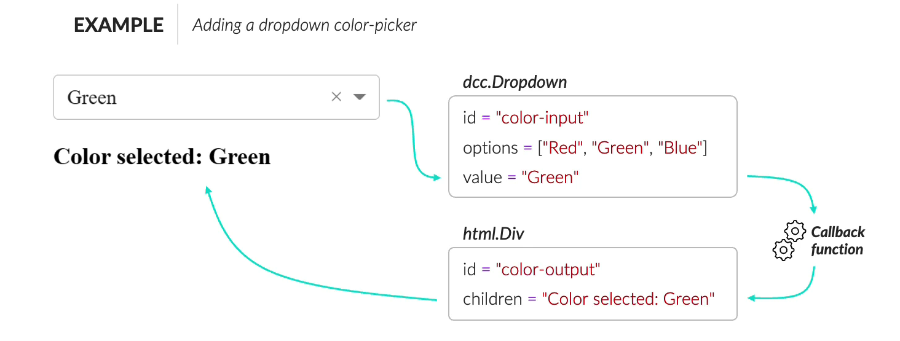

<h1>Dashboards</h1>
<section>This material is part of a course <a href="https://www.udemy.com/course/python-dashboards-plotly-dash/?kw=Python+Data+Visualization%3A+Dashboards+with+Plotly+%26+Dash&src=sac">Python Data Visualization: Dashboards with Plotly & Dash</a>, created by Chris Bruehl, on Udemy. I'm studing with this course, and here I'm puting my anotations about the course. An excelent course. </section>
<h3>Install plotly and dash via conda</h3>

!conda install --yes --prefix {sys.prefix} plotly!

!conda install --yes --prefix {sys.prefix} dash

<h3>Install plotly and dash via terminal</h3>

!pipx install plotly dash

<strong>OBS</strong>: It's recommended to update your pip version
 
<h3>You can <strong>create a dash application</strong> by following these steps:</h3>
<ol>
    <li>Install the necessary libraries</li>
    <ul>
        <li>dash</li>
        <li>plotly</li>
    </ul>
    <li>Import the necessary libraries</li>
    <li>Create the Dash app</li>
    <ul>
        <li>app = Dash(__name__)</li>
    </ul>
    <li>Set up the HTML layout (This is the front end of the web app)</li>
    <ul>
        <li>app.layout = html.Div([...])</li>
    </ul>
    <li>Add the callback functions (This is the back end of the web app)</li>
    <ul>
        <li>@app.callback(Output(), Input()) <!--* Ties dropdown to chart --> 
            def interactive_chart(input): <!--* Create a function accepts dropdown value as argument --> 
            ____   return output <!--* Usually a Plotly chart --></li> 
    </ul>
    <li>Run the app</li>
    <ul>
        <li>app.run_server(debug=True)</li>
    </ul>
</ol>
<h3>Hello Dash</h3>

    from dash import Dash, html

    app = Dash(__name__) -> this is typically assigned to a variable called "app"

    app.layout = html.Div("Hello Dash!") -> Use the HTML module to specify the visual components and assign in to app.layout

    if __name__ == "__main__":
        app.run_server(debug=True)

Dash is running on http://127.0.0.1:8050/
<h3>Interactive Elements</h3>

 These interactive elements are useless until they are processed in the back-end with <strong style="color: yellow;">callback functions</strong>

<h2>Example</h2>

This dcc.Dropdown() component has three properties:

<ol>
    <li> <strong>options</strong>: contains the contents of the dropdown</li>
    <ul>
        <li>This is a list of strings that populate the dropdown menu;</li>
        <li>The option selected by the user gets passed through the value;</li>
        <li>It's possible to have a user facing label that differs from the value processed in the backend.</li>
    </ul>
    <li><strong>id</strong>: The identifier for the value passed through</li>
    <ul>
        <li>This is the unique identifier for the dropdown</li>
    </ul>
    <li><strong>value</strong>: The option selected</li>
    <ul>
        <li>This helps set a default "starting" value if needed;</li>
        <li>This property changes whenever a user selects a new option.</li>
    </ul>
</ol>
<h3>Callback functions</h3>process user input and update the app accordingly
<ul>
    <li>They are triggered by a change to a property of an HTML component (input)</li>
    <li>They then change the property of another HTML component (output)</li>
</ul>

Callback functions are defined in the <strong>@app.callback</strong> decorator and have at least two arguments (Output & Input), followed by function itself

    
    @app.callback(
        Output(component_id, component_property),
        Input(component_id, component_property),
    )
    def function_name(variable):
        #function steps
        return f"Output {variable}"

The Input & Output arguments of the callback decorator. <strong>(Output goes first!)</strong> 
The id of the html component that triggers (input) or gets modified by (output) the callback function 
The property of the html component that is passed into (input) or gets modified by (output) the callback function 

    <ul>
    <strong>Examples:</strong>
        <li><strong>"children"</strong> for text</li>
        <li><strong>"value"</strong> for interactive elements</li>
        <li><strong>"figure"</strong> for charts</li>
    </ul>

<h2>Example</h2>

    app.layout = html.Div([
    "Pick a Country",
    dcc.Dropdown(
        options=["Brazil", "China", "India", "Indonésia", "USA"],
        id="country-input",
        value="Brazil"
    ),
    html.Div(id="country-output"),
    ])

    @app.callback(Output("country-output", "children"), Input("country-input", "value"))
    def update_output_div(country):
        return f"Country selected: {country}"

Callback functions run as soon as the app launches by default, but you can add logic to prevent updates

<ul>
    <li>This can help avoid errors when interactive elements are in an "empty state"</li>
    
</ul>
<h3>Application Run Options</h3>

Ther're several Application Run Options you can use when running the app:

<ul>
    <li><strong>debug=True</strong>: helps with troubleshooting during development (i.e., better error messages</li>
    <li><strong>host/port</strong>: specify the server address of the app - the default is: http://127.0.0.1:8050/</li>
    <li><strong>mode="inline"</strong>: runs the app in-notebook when using JupyterDash (not an option in Dash)</li>
    <li><strong>height/width</strong>: set the height or width of the app in pixels or a percentage</li>
</ul>

    if __name__ == "__main__":
        app.run_server(debug=True, host="0.0.0.0", port=8051, mode="inline", height=1000, width=80%)

<h3>PRO TIP:</h3> the <strong>host/port</strong> option became more important when deploying your application; and setting <strong>width</strong> as a percentage is a great way to keep your app proportions consistent 
<h3>Interactive Plotly Visuals</h3>

You can add interactive Plotly visuals to Dash apps with these 3 steps: 

<ol>
    <li>Create a "prototype" visual Pandas & Plotly without interactivity;</li>
    <li>Indetify the element that changes and define its option in the interactive component;</li>
    <li>Connect the interactive component to the visual using a callback function</li>
</ol>
<h2>Example</h2> | Visualizing the different datasets form Anscombe's Quartet

    app.layout = html.Div([
        html.H3("Anscombe's Quartet"),
        dcc.Graph(
            id="visual,
            figure=px.scatter(df.loc[df["dataset"] == "I", [x="x", y="y"]],)
        )
    ])

You can add a Plotly visual to your app eith the <strong>figure</strong> property of the <strong>dcc.Graph</strong> component.

Step 1 | Create a "prototype" visual Pandas & Plotly without interactivity

Step 2 | Indetify the element that changes and define its option in the interactive component

Step 3 | Connect the interactive component to the visual using a callback function

